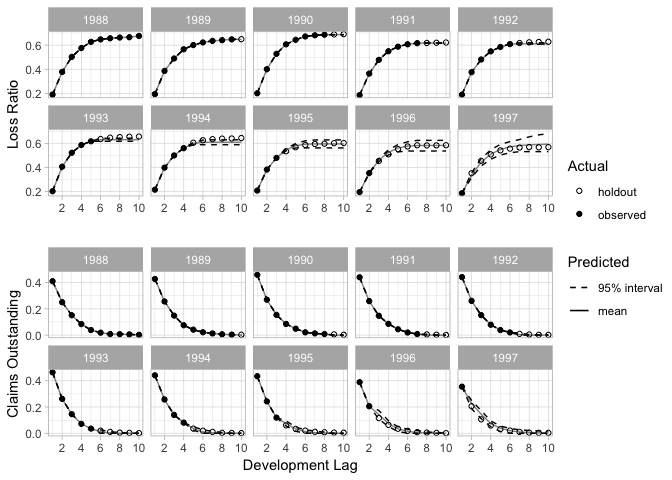
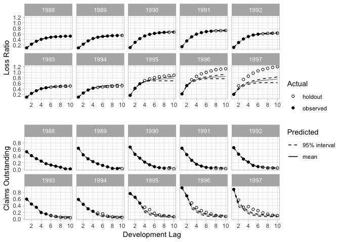

<!-- README.md is generated from README.Rmd. Please edit that file -->

[](https://travis-ci.org/kasaai/deeptriangle)

# DeepTriangle

This is the companion repository to the paper [*DeepTriangle: A Deep
Learning Approach to Loss
Reserving*](https://www.mdpi.com/2227-9091/7/3/97).

## Experiments

To get started, either clone the repo and build the R package, or
install with

``` r
devtools::install_github("kasaai/deeptriangle")
```

You will also need the [insurance](https://github.com/kasaai/insurance)
package, which can be installed with

``` r
devtools::install_github("kasaai/insurance")
```

The experiments can be found in `analysis/main.R`. It is recommended
that you use a GPU since many instances of the models are fit.

For convenience, we provide a `predictions.feather` file in the release.

``` r
predictions <- feather::read_feather("datasets/predictions.feather")

model_results <- dt_compute_metrics(predictions) %>%
  bind_rows(stochastic_model_results) %>%
  bind_rows(read_csv("datasets/automl_results.csv")) %>%
  gather(metric, value, mape, rmspe)

dt_tabulate_metrics(model_results, metric = "mape") %>%
  knitr::kable(booktabs = "T", digits = 3)
```

| lob                      |  Mack |   ODP |   CIT |   LIT | AutoML | DeepTriangle |
| :----------------------- | ----: | ----: | ----: | ----: | -----: | -----------: |
| commercial\_auto         | 0.060 | 0.217 | 0.052 | 0.052 |  0.068 |        0.043 |
| other\_liability         | 0.134 | 0.223 | 0.165 | 0.152 |  0.142 |        0.109 |
| private\_passenger\_auto | 0.038 | 0.039 | 0.038 | 0.040 |  0.036 |        0.025 |
| workers\_compensation    | 0.053 | 0.105 | 0.054 | 0.054 |  0.067 |        0.046 |

To create actual vs. predicted plots, use the `dt_plot_predictions()`
function. Here are successful and unsuccessful examples of the model’s
forecasting attempts.

Company 1767 commercial auto.



Company 337 workers’ compensation.



## Testing different architectures

If you would like to try out different architectures or hyperparameters,
you can do so by providing a function that returns a keras model. See
the source code of `dt_model()` for a template.

For more details on the **keras** R package, visit
<https://keras.rstudio.com/>.
