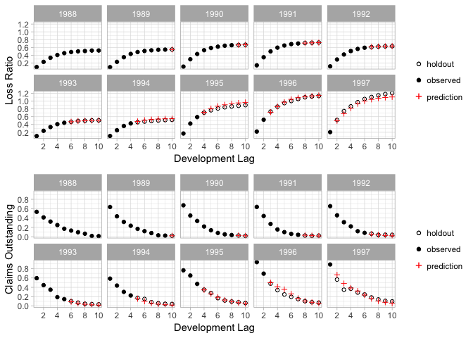

<!-- README.md is generated from README.Rmd. Please edit that file -->

[](https://travis-ci.org/kevinykuo/deeptriangle)

# DeepTriangle: A Deep Learning Approach to Loss Reserving

This is the companion repository to the DeepTriangle paper. A preprint
can be found at <https://arxiv.org/abs/1804.09253>.

## Reproducing experiments

To get started, either clone the repo and build the R package, or
install with

``` r
devtools::install_github("kevinykuo/deeptriangle)
```

You will also need the
[insurance](https://github.com/kevinykuo/insurance) package, which can
be installed with

``` r
devtools::install_github("kevinykuo/insurance")
```

The following lines of code will instantiate and fit the model for each
line of business then combine the forecasts in a data frame:

``` r
library(deeptriangle)
library(tidyverse)
library(keras)

# set seed for reproducibility
use_session_with_seed(2018)

data <- dt_data_prep(insurance::schedule_p, dt_group_codes)

lobs <- c("workers_compensation", "commercial_auto",
          "private_passenger_auto", "other_liability")

predictions <- lobs %>%
  map(
    function(x) {
      # clear session and instantiate model
      k_clear_session()
      model <- dt_model()

      c(training_data, validation_data, full_training_data) %<-%
        dt_train_validation_split(data[[x]])

      message("Training - ", x)

      # determine number of epochs
      epochs_to_train <- dt_optimize_epochs(
        model, training_data, validation_data
      )

      # clear session and reinstantiate model
      k_clear_session()
      model <- dt_model()

      # fit model to all training data
      history <- model %>%
        fit(x = full_training_data$x,
            y = full_training_data$y,
            batch_size = 128,
            epochs = epochs_to_train,
            verbose = 0)
      dt_compute_predictions(model, data[[x]])
    }) %>%
  bind_rows()
```

We can then compute performance metrics…

``` r
model_results <- dt_compute_metrics(predictions) %>%
  bind_rows(stochastic_model_results) %>%
  gather(metric, value, mape, rmspe)
```

and tabulate the results:

``` r
dt_tabulate_metrics(model_results, metric = "mape") %>%
  knitr::kable(booktabs = "T", digits = 3)
```

| lob                      |  Mack |   ODP |   CIT |   LIT |   CSR | DeepTriangle |
| :----------------------- | ----: | ----: | ----: | ----: | ----: | -----------: |
| commercial\_auto         | 0.060 | 0.217 | 0.052 | 0.052 | 0.074 |        0.060 |
| other\_liability         | 0.134 | 0.223 | 0.165 | 0.152 | 0.292 |        0.121 |
| private\_passenger\_auto | 0.038 | 0.039 | 0.038 | 0.040 | 0.037 |        0.026 |
| workers\_compensation    | 0.053 | 0.105 | 0.054 | 0.054 | 0.075 |        0.039 |

``` r
dt_tabulate_metrics(model_results, metric = "rmspe") %>%
  knitr::kable(booktabs = "T", digits = 3)
```

| lob                      |  Mack |   ODP |   CIT |   LIT |   CSR | DeepTriangle |
| :----------------------- | ----: | ----: | ----: | ----: | ----: | -----------: |
| commercial\_auto         | 0.080 | 0.822 | 0.076 | 0.074 | 0.126 |        0.085 |
| other\_liability         | 0.202 | 0.477 | 0.220 | 0.209 | 0.843 |        0.171 |
| private\_passenger\_auto | 0.061 | 0.063 | 0.057 | 0.060 | 0.055 |        0.036 |
| workers\_compensation    | 0.079 | 0.368 | 0.080 | 0.080 | 0.159 |        0.064 |

To create actual vs. predicted plots, use the `dt_plot_predictions()`
function.

``` r
dt_plot_predictions(predictions, "337", "workers_compensation",
                    "paid_loss")
```



``` r
dt_plot_predictions(predictions, "337", "workers_compensation",
                    "claims_outstanding")
```


